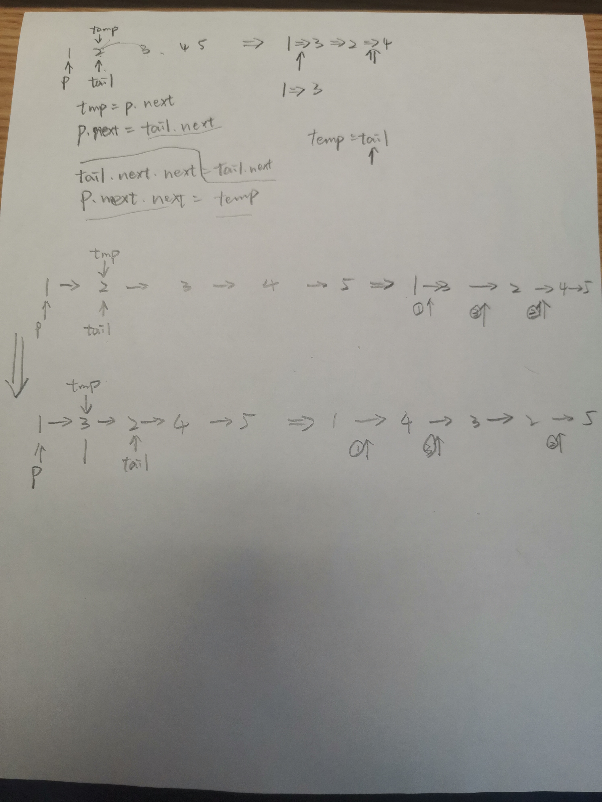

# 92. Reverse Linked List II

* Medium
* Given the `head` of a singly linked list and two integers `left` and `right` where `left <= right`, reverse the nodes of the list from position `left` to position `right`, and return _the reversed list_.

### Analysis&#x20;

In this problem we will try to revese the list from left to right two digits at a time.&#x20;



.png>)

```
class Solution:
    def reverseBetween(self, head: Optional[ListNode], left: int, right: int) -> Optional[ListNode]:
        if left==right or not head:
            return head 
        p=dummy=ListNode(0)
        dummy.next=head 
        for i in range(left-1):
            p=p.next
            
        tail=p.next
        for i in range(right-left):
            temp=p.next
            p.next=tail.next
            tail.next=tail.next.next
            p.next.next=temp
            
        return dummy.next 
```
